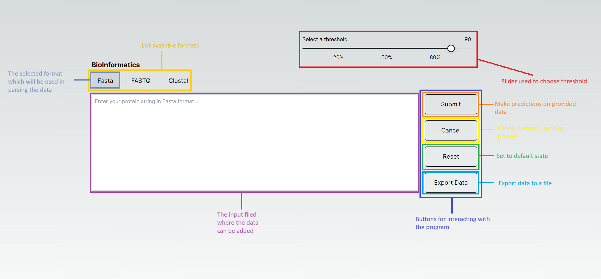
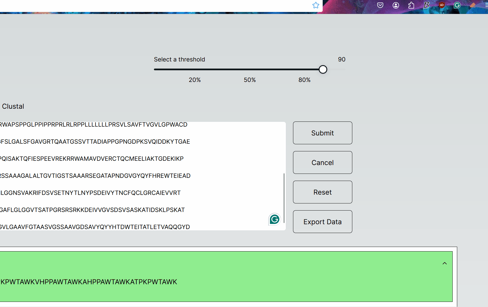
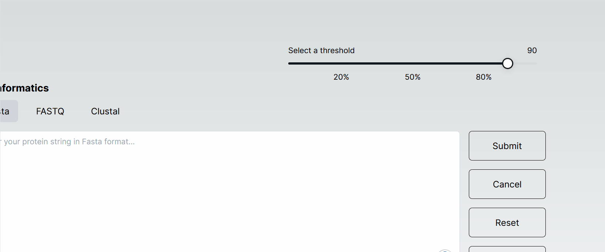
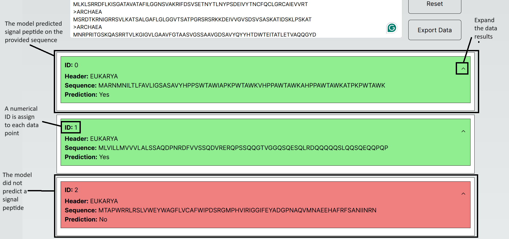
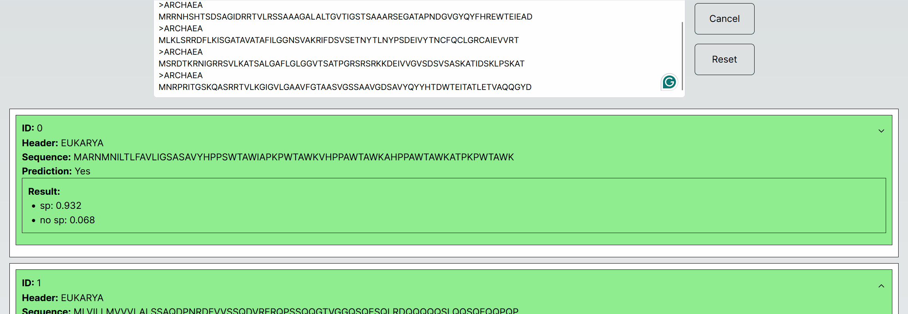

# MOL3022 - Front End - Signal Peptide

The project is the front the part of a signal peptide prediction project in the "MOL3022 - Bioinformatics - Method Oriented Project" course. The application is taking data (protein sequencies in some format like Fasta) and is sending those string to the backend where it uses those to make predictions, then the application displays the results to the user. The application is implemented for pre-processing of data which allows the user to find out if a protein sequence has a peptide or not. The results will allow the users to separate the data into sequences with and without signal peptide. The application was created with the motivation of providing the user with a quick and convenient way checking of a protein sequences has a protein peptide, and the results of this can be downloaded and used in future research. The project depends the backend called [`andreas122001/MOL3022-bioinformatics-project`](https://github.com/andreas122001/MOL3022-bioinformatics-project). This is a [Next.js](https://nextjs.org/) project bootstrapped with [`create-next-app`](https://github.com/vercel/next.js/tree/canary/packages/create-next-app).

## Getting Started

### Prerequisites

Make sure that you have the following installed on your system:

- [Node](https://nodejs.org/en)
- [npm](https://www.npmjs.com/)
- [Next](https://nextjs.org/)
- [React](https://react.dev/)

### Run the application

To get started with the project, follow these steps:

1. Navigate to the project directory: `cd <project-directory>`
2. Install the dependencies: `npm install`
3. Run the development server: `npm run dev`
4. Open [http://localhost:3000](http://localhost:3000) with your browser to see the result.

## Available Scripts

In the project directory, you can run the following scripts (commands are define the in the `package.json`):

### `npm run dev`

Runs the development server. Open [http://localhost:3000](http://localhost:3000) to view it in the browser (as mentioned above).

### `npm run build`

Builds the app for production to the `build` folder. It correctly bundles Next.js in production mode and optimizes the build for the best performance.

### `npm run lint`

Runs the linter to check for code style and formatting issues. This project uses the [ESlint](https://eslint.org/) for linting. If you use VSCode, it is recommended to use the [VSCode ESLinter Extension](https://marketplace.visualstudio.com/items?itemName=dbaeumer.vscode-eslint). If you prefer JetBrain products, [WebStorm ESLint Plugin](https://www.jetbrains.com/help/webstorm/eslint.html) and [IntelliJ IDEs Plugin](https://plugins.jetbrains.com/plugin/7494-eslint) are available.

### `npm run test`

Run the automated tests and output the testing results. See the Next.js documentation about [running tests](https://nextjs.org/docs/app/building-your-application/testing/jest).

## The Page

The main page is comprised of an input filed (purple), the data formats that the user can choose, the buttons for interaction with the program (violet) and slider to choose the threshold (red). The threshold is the confidence tha the system need before claim that a passed in protein string has a signal peptide.



The data can be downloaded as demonstrated the the following GIF:



The threshold can be chosen. The threshold has to be chosen by sliding the slider as demonstrated by the following GIF:



## The Results

The provided data is parsed, and for each data point a separate prediction is performed. The prediction can be above the threshold (green) or the below (red). Each data points gets an associated ID. Also each results can be expanded and see the more exact resulting values.



The expansion and closing is demonstrated by the following GIF:



## The Data Types and Interfaces

Different structures are used in the application. This sections describes of each those structures, that save represented by interface and types.

### FormatClass

This interface represents a format class with the following properties:

- `header`: A string representing the header.
- `sequence`: A string representing the sequence.
- `format`: A string representing the format.

```ts
export interface FormatClass {
  header: string;
  sequence: string;
  format: string;
}
```

### FormatParser

This interface represents a format parser with the following methods:

- `parse(input: string)`: This method takes a string as input and returns a `FormatInstance`.
- `multipleParse(input: string)`: This method takes a string as input and returns a `FormatInstanceList`.

```ts
export interface FormatParser {
  parse(input: string): FormatInstance;
  multipleParse(input: string): FormatInstanceList;
}
```

### Format

This is a type that can be either "Fasta", "FASTQ", or "Clustal" strings.

```ts
export type Format = "Fasta" | "FASTQ" | "Clustal";
```

### FormatInstanceList

This is a type that can be an array of `Fasta`, `Fastq`, or `Clustal` classes.

```ts
export type FormatInstanceList = Fasta[] | Fastq[] | Clustal[];
```

### FormatInstance

This is a type that can be either `Fasta`, `Fastq`, or `Clustal` class.

```ts
export type FormatInstance = Fasta | Fastq | Clustal;
```

### ResponseFormat

This interface represents a response format with the following properties:

- `sp`: A float number representing the probability signal peptide.
- `no_sp`: A float number representing the probability of that the signal peptide is no on the protein sequence.

```ts
export interface ResponseFormat {
  sp: number;
  no_sp: number;
}
```

### DataPointState

This interface represents a data point state with the following properties:

- `id`: A string representing the id.
- `prediction`: An optional boolean representing the prediction (signal peptide probability above threshold = true).
- `completeResponseString`: A string representing the complete response string.
- `requestFinished`: A boolean representing if the request has finished.
- `data`: A `FormatInstance` representing the data instance.
- `result`: A `ResponseFormat` representing the result returned for the backend.

```ts
export interface DataPointState {
  id: string;
  prediction?: boolean;
  completeResponseString: string;
  requestFinished: boolean;
  data: FormatInstance;
  result: ResponseFormat;
}
```

## Structure of the Application

The file `pages/index.tsx` is the access point for the application. The application uses components from the `components` folder. The types are placed in the `types` folder and styling is placed in the `styles`. Config files of the project are the following:

- `package.json` - the [dependencies and configurations](https://docs.npmjs.com/cli/v10/configuring-npm/package-json) of the project in a JSON format. The file is used when using the command `npm install` to install the project dependencies.
- `.eslintrc.js` - the [linting configurations](https://eslint.org/docs/latest/use/configure/configuration-files) file. The configurations are used for the linting process ESLint and the linting in the GitHub pipeline.
- `tailwind.config.ts` - [tailwind configuration](https://tailwindcss.com/docs/configuration) file. The styling configuration of the CSS framework.
- `.env` - environment variables file. The file is loaded by Next on compiling.
- `jest.config.js` - the configurations of the Jest automated testing library and are used when using command `npm run test` or command [`jest`](<(https://jestjs.io/docs/cli)>) (if you have [Jest CLI installed](https://www.npmjs.com/package/jest-cli))
